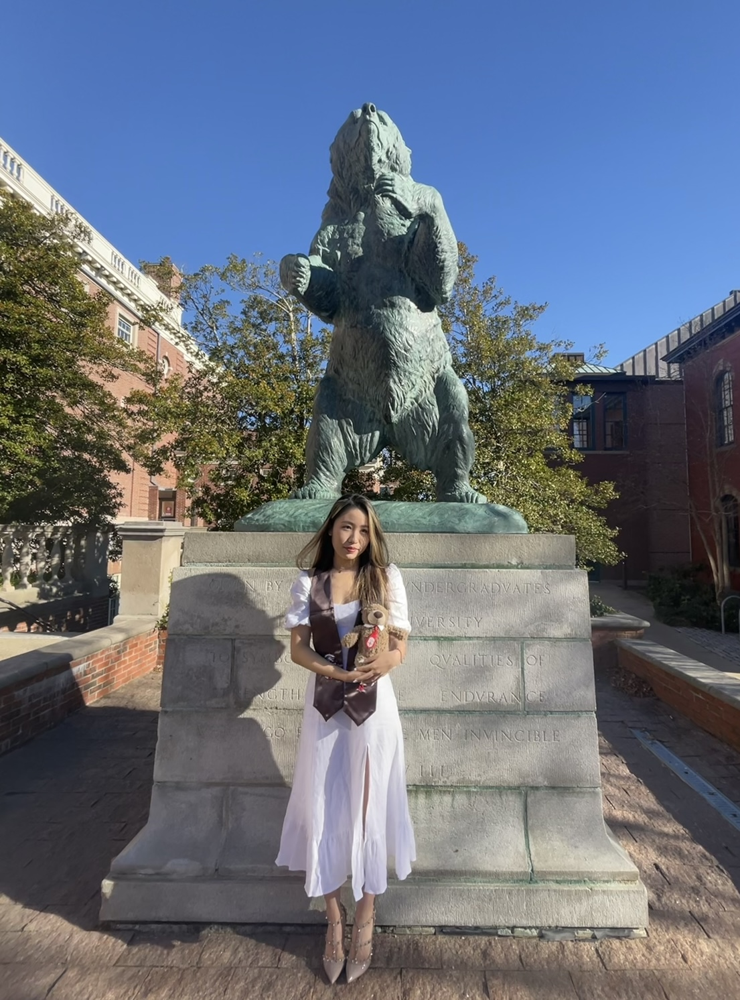

# Basic Information
* Name: Ruyi Chen
* Nationality: Chinese
* Tel: 646-942-1397
* Email: rc3520@cumc.columbia.edu

# Education

* Columbia University, New York, NY (MS of Biostatistics)                       09/2022 - 05/2024
* Brown University, Providence, RI  (Bachelor of Arts in Biology)               09/2019 - 12/2021 

# Relative Experience
* Fosun Pharma (Investment Analyst Intern, Healthcare Investment Group)         03/2022 – 06/2022     
  * Analyzed company financial statements, industry trends, and macroeconomic factors to develop investment strategies
  * Presented insightful and actionable investment ideas in genetic engineering industry and medical devices industry once a week
  *	Conducted research and analysis of companies in various sectors
  *	Conducted more than 20 interviews to the experts in the industry and physicians in the hospital to obtain a thorough comprehension on the products and the markets

* Frost & Sullivan  (Analyst Intern, Biomedical Group)                          05/2021 - 09/2021
  * Collected data on the number of patients who are eligible to specific target in respond to first-line and second line treatment for different diseases 
  * Analyzed each product’s sale revenue in treatment of different diseases by combining with the penetration rate of certain drug in different targets and number of addressable patients via Python and Excel 
  * Conducted 12 interviews to the management team and stakeholders of my project company to obtain deeper understanding of the drug development stage  
  * Developed models with BioRender to explain biological mechanisms and signal transductions for the Biomedical Group  
  *	Gathered information about incidence rates, treatment rate and relapse rate of diseases including lung cancer, ovarian cancer, pancreatic cancer, breast cancer, melanoma and endometrial cancer from PubMed, Insight, and Global Cancer Observatory to support the study and market research  

* Harbour BioMed  (Researcher, Early Development Department )                   06/2020 - 09/2020 
  *	Conducted cell-based bench work and experiments including tumor cell culture, primary immune cell culture, ELISA, FACS assay  
  * Recorded molecular experiment data by using excel and organized data by using ggplot2 and MATLAB

# Additional
* Lab Skills: IR spectrum analysis, Cell and fiber staining, Column chromatography, Simple and fractional distillation, UVVis spectrophotometry, Gel electrophoresis and Culture cells etc.; Use of Instruments: light microscope, pH meter, centrifuges and incubators.; ELISA and FACS assays. 

* Computer Skills: R language, MySQL, BioRender, Java, MATLAB, StatCrunch, Advanced Excel 

* Harvard Extension Courses: Introduction to Computer Science and Introduction to Programming with Python 

* Hobbies: Choreographer (Jazz, Hiphop, Swag and Urban); Performer at HHI 2020 (Hip-Hop International) 

